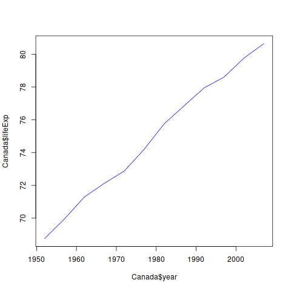

**Bold** - bold with double astericks  
_Italics_ - Italics with Underscores  
`R` - Code with backticks  
  (two spaces = new line)

# Title
## Main Section
### Sub Section
#### Sub-Sub Section

- Item 1
- Item 2
- Item 3
  
1. Item 1
2. Item 2
3. Item 3

1. Item 1
1. Item 2
1. Item 3

[comment]: This line is a comment
[//]: This is also a comment
[]: This is try

[This is my link](https://wwww.google.com)

<https://wwww.google.com>




$\displaystyle\int^5_13x+5dx$

```{r load_data}
gapminder <- read.table("./Data/gapminder.txt", header = T)

# Subset Canada only
Canada <- gapminder[gapminder$country=="Canada",]


library(ggplot2)

#### Challenge 1 ####
ggplot(data = Canada, aes(x = year, y = lifeExp, by = country, color = continent)) + geom_line(size = 2)
```

[comment]: echo=FALSE hides the code
``` {r working_of_knitr, echo=FALSE, results='hide', eval=TRUE, warning=FALSE, FIG.HGEIGHT=8, FIG.WIDTH=8}
par(mar=rep(0, 4), bty="n", cex=1.5)
plot(0, 0, type="n", xlab="", ylab="", xaxt="n", yaxt="n",
     xlim=c(0, 100), ylim=c(0, 100))
xw <- 10
yh <- 35
xm <- 12
ym <- 50
rect(xm-xw/2, ym-yh/2, xm+xw/2, ym+yh/2, lwd=2)
text(xm, ym, ".Rmd")

xm <- 50
ym <- 80
rect(xm-xw/2, ym-yh/2, xm+xw/2, ym+yh/2, lwd=2)
text(xm, ym, ".md")
xm <- 50; ym <- 25
for(i in c(2, 0, -2))
    rect(xm-xw/2+i, ym-yh/2+i, xm+xw/2+i, ym+yh/2+i, lwd=2,
         border="black", col="white")
text(xm-2, ym-2, "figs/")

xm <- 100-12
ym <- 50
rect(xm-xw/2, ym-yh/2, xm+xw/2, ym+yh/2, lwd=2)
text(xm, ym, ".html")

arrows(22, 50, 38, 50, lwd=2, col="slateblue", len=0.1)
text((22+38)/2, 60, "knitr", col="darkslateblue", cex=1.3)

arrows(62, 50, 78, 50, lwd=2, col="slateblue", len=0.1)
text((62+78)/2, 60, "pandoc", col="darkslateblue", cex=1.3)
```

# In Line code

The average of the class is `r round(44.0673946, 2)`.